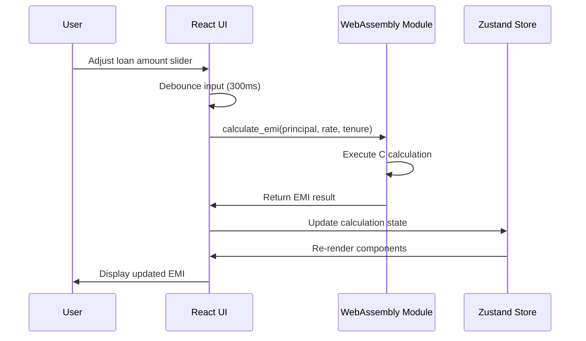
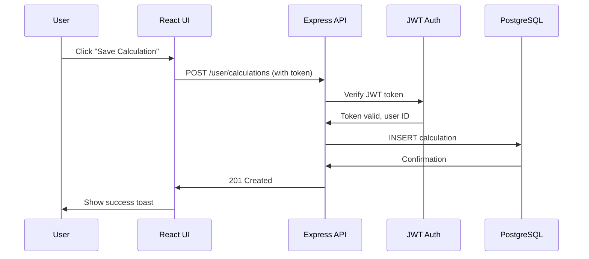
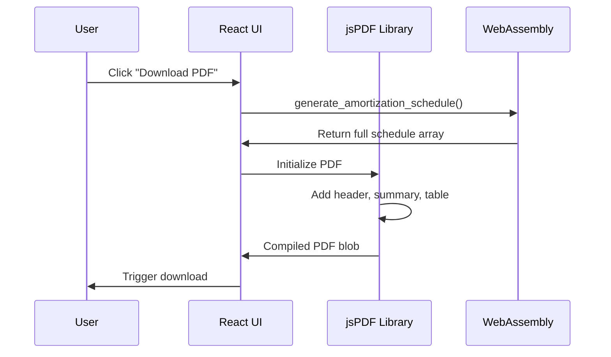

# Smart EMI & TVM Calculator - Technical Architecture Summary

This document provides a high-level overview of the complete technical architecture for the Smart EMI & TVM Calculator application.

---

## System Architecture Diagram


---

## Architecture Overview

The application follows a **three-tier architecture** with a focus on performance through WebAssembly-based calculations and a modern, responsive frontend.

### Layer 1: Frontend (Client-Side)
- **Framework**: React 18 with TypeScript
- **Build Tool**: Vite
- **State Management**: Zustand (global), React Hook Form (forms)
- **Styling**: Vanilla CSS with CSS Modules
- **Calculation Engine**: WebAssembly (compiled from C/C++)
- **Charts**: Recharts
- **PDF Generation**: jsPDF (client-side)

### Layer 2: API Layer (Application Server)
- **Runtime**: Node.js
- **Framework**: Express + TypeScript
- **Authentication**: JWT (JSON Web Tokens)
- **API Documentation**: Swagger/OpenAPI
- **PDF Service**: Node-based PDF generation (server-side alternative)

### Layer 3: Backend & Data (Storage Layer)
- **Database**: PostgreSQL (relational data)
- **Cache**: Redis (sessions, frequently accessed data)
- **File Storage**: AWS S3 or local filesystem
- **Calculation Modules**: C/C++ source code (compiled to WASM for frontend, Node addon for backend)

---

## Data Flow

### EMI Calculation Flow (Client-Side)



### Save Calculation Flow (Full Stack)



### PDF Export Flow



---

## Technology Stack Details

### Frontend Stack

| Technology | Version | Purpose |
|-----------|---------|---------|
| React | 18.x | UI framework |
| TypeScript | 5.x | Type safety |
| Vite | 5.x | Build tool, dev server |
| Zustand | 4.x | Global state management |
| React Router | 6.x | Client-side routing |
| React Hook Form | 7.x | Form state management |
| Recharts | 2.x | Charts and data visualization |
| jsPDF | 2.x | PDF generation |
| Framer Motion | 10.x | Animations |
| date-fns | 3.x | Date utilities |

### Backend Stack

| Technology | Version | Purpose |
|-----------|---------|---------|
| Node.js | 20.x LTS | Runtime environment |
| Express | 4.x | Web framework |
| TypeScript | 5.x | Type safety |
| PostgreSQL | 15.x | Primary database |
| Redis | 7.x | Caching, sessions |
| JWT | 9.x | Authentication |
| bcrypt | 5.x | Password hashing |
| node-postgres (pg) | 8.x | PostgreSQL client |
| ioredis | 5.x | Redis client |

### Calculation Engine

| Technology | Purpose |
|-----------|---------|
| C/C++ | Core calculation algorithms |
| Emscripten | C/C++ to WebAssembly compiler |
| node-addon-api | C++ Node.js bindings (optional) |
| WebAssembly | Client-side execution |

---

## Database Schema Summary

### Users Table
- Stores user accounts with authentication credentials
- Fields: user_id, email, password_hash, name, is_admin, created_at

### Calculations Table
- Stores saved EMI and TVM calculations
- Fields: calculation_id, user_id, calculation_type, inputs (JSONB), result (JSONB), created_at

### Content Table
- Admin-editable content (hero text, descriptions, etc.)
- Fields: content_id, key, value, content_type, category, updated_at

### Formulas Table
- Formula definitions with examples and descriptions
- Fields: formula_id, name, category, formula_text, description, variables (JSONB), example (JSONB)

### Sessions Table
- User session management (alternative to Redis)
- Fields: session_id, user_id, token_hash, created_at, expires_at

### PDF Exports Table
- Tracks generated PDF files
- Fields: export_id, user_id, calculation_id, file_path, created_at, expires_at

**See [implementation_plan.md](file:///home/tonmoy/Desktop/EMI%20nad%20TVM%20cal/../.gemini/antigravity/brain/b622d599-ec1c-4fa5-9267-960d47af4849/implementation_plan.md) for full SQL schema definitions.**

---

## API Architecture

### RESTful API Design

**Base URL**: `/api/v1`

**Endpoint Categories:**

1. **Authentication** (`/auth`)
   - POST `/register` - Create user account
   - POST `/login` - User login
   - POST `/logout` - User logout
   - POST `/refresh` - Refresh JWT token

2. **Calculator** (`/calculator`)
   - POST `/emi` - Calculate EMI
   - POST `/emi/amortization` - Get amortization schedule
   - POST `/emi/export-pdf` - Generate PDF export

3. **TVM** (`/tvm`)
   - POST `/present-value` - Calculate PV
   - POST `/future-value` - Calculate FV
   - POST `/annuity-pv` - Calculate annuity PV
   - POST `/annuity-fv` - Calculate annuity FV
   - POST `/perpetuity` - Calculate perpetuity
   - POST `/npv` - Calculate NPV
   - POST `/irr` - Calculate IRR

4. **User** (`/user`)
   - GET `/calculations` - Get saved calculations
   - POST `/calculations` - Save calculation
   - DELETE `/calculations/:id` - Delete calculation
   - GET `/profile` - Get user profile
   - PUT `/profile` - Update profile

5. **Admin** (`/admin`)
   - GET `/content` - Get all content
   - PUT `/content` - Update content
   - GET `/formulas` - Get formulas
   - POST `/formulas` - Add formula
   - PUT `/formulas/:id` - Update formula
   - DELETE `/formulas/:id` - Delete formula
   - GET `/users` - Get users
   - PUT `/users/:id` - Update user

**See [implementation_plan.md](file:///home/tonmoy/Desktop/EMI%20nad%20TVM%20cal/../.gemini/antigravity/brain/b622d599-ec1c-4fa5-9267-960d47af4849/implementation_plan.md) for detailed API specifications with request/response examples.**

---

## WebAssembly Integration

### Compilation Process

```bash
# Install Emscripten SDK
git clone https://github.com/emscripten-core/emsdk.git
cd emsdk
./emsdk install latest
./emsdk activate latest

# Compile C/C++ to WASM
emcc calculator.c tvm.c advanced.c \
  -O3 \
  -s WASM=1 \
  -s EXPORTED_FUNCTIONS='["_calculate_emi", "_calculate_pv", "_calculate_fv", ...]' \
  -s EXPORTED_RUNTIME_METHODS='["ccall","cwrap"]' \
  -o calculator.js

# Output files:
# - calculator.js (JavaScript glue code)
# - calculator.wasm (WebAssembly binary)
```

### Frontend Integration

```typescript
// wasm/bindings.ts
let Module: any;

export const initWASM = async () => {
  Module = await import('./calculator.js');
  await Module.ready;
};

export const calculateEMI = (
  principal: number,
  annualRate: number,
  tenureMonths: number
): number => {
  return Module.ccall(
    'calculate_emi',
    'number',
    ['number', 'number', 'number'],
    [principal, annualRate, tenureMonths]
  );
};

export const calculatePV = (
  futureValue: number,
  rate: number,
  periods: number
): number => {
  return Module.ccall(
    'calculate_pv',
    'number',
    ['number', 'number', 'number'],
    [futureValue, rate, periods]
  );
};

// ... more bindings
```

### Usage in Components

```typescript
import { calculateEMI } from '@/wasm/bindings';

const EMICalculator = () => {
  const [loanAmount, setLoanAmount] = useState(25000);
  const [interestRate, setInterestRate] = useState(9);
  const [tenure, setTenure] = useState(14);
  const [emi, setEmi] = useState(0);

  useEffect(() => {
    const result = calculateEMI(loanAmount, interestRate, tenure);
    setEmi(result);
  }, [loanAmount, interestRate, tenure]);

  return (
    <div>
      <h1>${emi.toFixed(2)}</h1>
    </div>
  );
};
```

---

## Performance Optimizations

### Frontend Optimizations

1. **Code Splitting**
   - Lazy load TVM calculators
   - Lazy load chart library
   - Lazy load admin panel

2. **WASM Loading**
   - Async initialization
   - Cache WASM module
   - Fallback to JavaScript if WASM unavailable

3. **Component Optimization**
   - React.memo for expensive components
   - useMemo for heavy calculations
   - useCallback for event handlers
   - Virtualization for long tables

4. **Asset Optimization**
   - Compress images (WebP format)
   - Optimize SVGs
   - Lazy load fonts with font-display: swap
   - Tree-shake unused code

### Backend Optimizations

1. **Database**
   - Index on user_id, calculation_type
   - Connection pooling (pg)
   - Query optimization

2. **Caching**
   - Redis for session data
   - Cache formula definitions
   - Cache content for 1 hour

3. **API**
   - Compression middleware (gzip)
   - Rate limiting
   - CORS optimization
   - Response pagination

---

## Security Measures

### Authentication & Authorization

```typescript
// JWT token structure
{
  userId: string,
  email: string,
  isAdmin: boolean,
  iat: number,
  exp: number
}

// Middleware
const authenticate = (req, res, next) => {
  const token = req.headers.authorization?.split(' ')[1];
  if (!token) return res.status(401).json({ error: 'Unauthorized' });
  
  try {
    const decoded = jwt.verify(token, JWT_SECRET);
    req.user = decoded;
    next();
  } catch (error) {
    return res.status(401).json({ error: 'Invalid token' });
  }
};

const requireAdmin = (req, res, next) => {
  if (!req.user.isAdmin) {
    return res.status(403).json({ error: 'Forbidden' });
  }
  next();
};
```

### Input Validation

```typescript
import { z } from 'zod';

const emiCalculationSchema = z.object({
  principal: z.number().min(1000).max(100000000),
  annualRate: z.number().min(0.1).max(30),
  tenureMonths: z.number().int().min(1).max(360)
});

app.post('/api/v1/calculator/emi', (req, res) => {
  const validation = emiCalculationSchema.safeParse(req.body);
  
  if (!validation.success) {
    return res.status(400).json({ 
      error: 'Invalid input',
      details: validation.error.issues
    });
  }
  
  // Process valid data
  const { principal, annualRate, tenureMonths } = validation.data;
  // ...
});
```

### Other Security Measures

- **Password Hashing**: bcrypt with salt rounds 10
- **HTTPS Only**: Force HTTPS in production
- **CORS**: Whitelist specific origins
- **Rate Limiting**: 100 requests per 15 min per IP
- **SQL Injection Prevention**: Parameterized queries
- **XSS Prevention**: Content Security Policy headers
- **CSRF Protection**: CSRF tokens for state-changing operations

---

## Deployment Architecture

### Frontend Deployment (Vercel/Netlify)

```yaml
# Build Configuration
build:
  command: npm run build
  publish: dist

# Environment Variables
VITE_API_URL: https://api.emicalculator.com
VITE_ENABLE_ANALYTICS: true

# Headers
/_/*
  X-Frame-Options: DENY
  X-Content-Type-Options: nosniff
  X-XSS-Protection: 1; mode=block
  Content-Security-Policy: default-src 'self'; script-src 'self' 'wasm-unsafe-eval'
```

### Backend Deployment (Railway/Render)

```yaml
# Dockerfile
FROM node:20-alpine

WORKDIR /app

COPY package*.json ./
RUN npm ci --only=production

COPY . .
RUN npm run build

EXPOSE 3000

CMD ["node", "dist/index.js"]
```

### Database Deployment (AWS RDS)

- PostgreSQL 15
- Multi-AZ deployment
- Automated backups (7-day retention)
- Read replicas for scaling
- Connection pooling via PgBouncer

### Redis Deployment (Redis Cloud)

- Redis 7.x
- Cluster mode for high availability
- Automatic failover
- SSL/TLS encryption

---

## Monitoring & Logging

### Application Monitoring

- **Frontend**: Sentry for error tracking
- **Backend**: Winston for logging, Sentry for errors
- **Performance**: Google Analytics, Web Vitals
- **Uptime**: UptimeRobot or Pingdom

### Metrics to Track

| Metric | Target | Tool |
|--------|--------|------|
| Page Load Time | < 2s | Lighthouse |
| API Response Time | < 200ms | New Relic |
| Error Rate | < 0.1% | Sentry |
| Uptime | 99.9%+ | UptimeRobot |
| Database Queries | < 50ms | PostgreSQL logs |

---

## Scalability Considerations

### Horizontal Scaling

- **Frontend**: CDN distribution (Cloudflare, Vercel Edge)
- **Backend**: Load balancer (AWS ALB, Nginx)
- **Database**: Read replicas, sharding by user_id
- **Redis**: Cluster mode

### Vertical Scaling

- **Backend Server**: 2 vCPU, 4GB RAM (initial)
- **Database**: db.t3.medium (initial), scale up as needed
- **Redis**: 1GB memory (initial)

### Caching Strategy

```typescript
// Redis caching example
const getCachedContent = async (key: string) => {
  const cached = await redis.get(key);
  if (cached) return JSON.parse(cached);
  
  const content = await db.query('SELECT * FROM content WHERE key = $1', [key]);
  await redis.setex(key, 3600, JSON.stringify(content)); // Cache for 1 hour
  
  return content;
};
```

---

## Testing Strategy

### Unit Tests

```typescript
// Example: Calculator WASM tests
describe('calculateEMI', () => {
  it('should calculate correct EMI for given inputs', () => {
    const result = calculateEMI(25000, 9, 14);
    expect(result).toBeCloseTo(250.12, 2);
  });

  it('should handle edge case: very low interest', () => {
    const result = calculateEMI(10000, 0.1, 12);
    expect(result).toBeGreaterThan(0);
  });
});
```

### Integration Tests

```typescript
// Example: API endpoint test
describe('POST /api/v1/calculator/emi', () => {
  it('should return EMI calculation', async () => {
    const response = await request(app)
      .post('/api/v1/calculator/emi')
      .send({ principal: 25000, annualRate: 9, tenureMonths: 14 })
      .expect(200);
    
    expect(response.body.data.monthlyEMI).toBeCloseTo(250.12, 2);
  });

  it('should validate input', async () => {
    const response = await request(app)
      .post('/api/v1/calculator/emi')
      .send({ principal: -1000, annualRate: 9, tenureMonths: 14 })
      .expect(400);
    
    expect(response.body.error).toBe('Invalid input');
  });
});
```

### E2E Tests (Playwright/Cypress)

```typescript
// Example: User flow test
test('Calculate EMI and download PDF', async ({ page }) => {
  await page.goto('/');
  
  await page.fill('[data-testid="loan-amount"]', '25000');
  await page.fill('[data-testid="interest-rate"]', '9');
  await page.fill('[data-testid="tenure"]', '14');
  
  await expect(page.locator('[data-testid="emi-result"]')).toContainText('$250');
  
  const downloadPromise = page.waitForEvent('download');
  await page.click('[data-testid="download-pdf"]');
  const download = await downloadPromise;
  
  expect(download.suggestedFilename()).toContain('.pdf');
});
```

---

## Development Workflow

### Git Branching Strategy

```
main (production)
  ├── develop (staging)
  │   ├── feature/emi-calculator
  │   ├── feature/tvm-hub
  │   ├── feature/admin-panel
  │   └── bugfix/slider-precision
  └── hotfix/security-patch
```

### CI/CD Pipeline

```yaml
# .github/workflows/ci.yml
name: CI/CD

on:
  push:
    branches: [main, develop]
  pull_request:
    branches: [main, develop]

jobs:
  test:
    runs-on: ubuntu-latest
    steps:
      - uses: actions/checkout@v3
      - uses: actions/setup-node@v3
      - run: npm ci
      - run: npm run lint
      - run: npm run test
      - run: npm run build

  deploy:
    needs: test
    if: github.ref == 'refs/heads/main'
    runs-on: ubuntu-latest
    steps:
      - uses: actions/checkout@v3
      - uses: vercel/actions/deploy@v1
```

---

## Summary of Key Architectural Decisions

1. **WebAssembly for Calculations**: Maximum performance for complex financial calculations
2. **React + TypeScript**: Type safety and modern development experience
3. **PostgreSQL**: Reliable relational database for structured data
4. **Redis**: Fast caching for session and frequently accessed data
5. **JWT Authentication**: Stateless authentication for scalability
6. **Client-Side PDF**: Reduces server load, faster generation
7. **Responsive Design**: Mobile-first approach for accessibility
8. **Microservices-Ready**: Can split calculation engine into separate service if needed

---

## Next Steps

1. **Prototyping**: Build working prototype with core EMI calculator
2. **WASM Development**: Implement and compile C/C++ calculations
3. **Component Library**: Build reusable UI components
4. **API Development**: Implement REST endpoints
5. **Database Setup**: Create schema and seed data
6. **Testing**: Unit, integration, and E2E tests
7. **Deployment**: Set up CI/CD and hosting
8. **Monitoring**: Implement logging and error tracking

---

## Related Documents

- [Implementation Plan](file:///home/tonmoy/.gemini/antigravity/brain/b622d599-ec1c-4fa5-9267-960d47af4849/implementation_plan.md)
- [UI Wireframes](file:///home/tonmoy/Desktop/EMI%20nad%20TVM%20cal/ui-wireframes.md)
- [UX Flow](file:///home/tonmoy/Desktop/EMI%20nad%20TVM%20cal/ux-flow.md)
- [Component Specification](file:///home/tonmoy/Desktop/EMI%20nad%20TVM%20cal/component-specification.md)
- [Design System Guide](file:///home/tonmoy/Desktop/EMI%20nad%20TVM%20cal/design-system-guide.md)

