# Smart EMI & TVM Calculator - UX Flow Diagram

This document maps out the complete user experience flow, including navigation paths, user journeys, and interaction patterns.

---

## Overall App Navigation Structure

```mermaid
graph TD
    Start([App Launch]) --> Home[Home: EMI Calculator]
    
    Home --> Breakdown[View Breakdown]
    Home --> SaveCalc[Save Calculation]
    Home --> TVMHub[TVM Hub]
    Home --> Formulas[Formula Guide]
    Home --> Concepts[Concepts]
    
    Breakdown --> PDFExport[Download PDF]
    Breakdown --> BackHome[Back to Calculator]
    
    TVMHub --> PVCalc[PV Calculator]
    TVMHub --> FVCalc[FV Calculator]
    TVMHub --> AnnuityPV[Annuity PV]
    TVMHub --> AnnuityFV[Annuity FV]
    TVMHub --> Perpetuity[Perpetuity]
    TVMHub --> NPV[NPV Calculator]
    TVMHub --> IRR[IRR Calculator]
    
    PVCalc --> SaveTVM[Save TVM Calc]
    FVCalc --> SaveTVM
    
    Formulas --> SearchFormula[Search Formulas]
    Formulas --> FormulaDetail[Formula Detail]
    
    Concepts --> ConceptDetail[Concept Page]
    ConceptDetail --> NextConcept[Next Concept]
    
    Home --> MyCalcs[My Calculations]
    MyCalcs --> ViewSaved[View Saved Calc]
    MyCalcs --> DeleteCalc[Delete Calc]
    
    Home --> Settings[Settings]
    Settings --> ThemeToggle[Theme Switch]
    Settings --> Currency[Currency Settings]
    
    Home --> Admin[Admin Panel]
    Admin --> ContentMgmt[Content Management]
    Admin --> FormulaMgmt[Formula Management]
    Admin --> UserMgmt[User Management]
    
    style Home fill:#2B7FF6,stroke:#1E3A8A,stroke-width:3px,color:#fff
    style TVMHub fill:#4A9FFF,stroke:#2B7FF6,stroke-width:2px,color:#fff
    style Breakdown fill:#26E5D8,stroke:#1EA59D,stroke-width:2px,color:#000
```

---

## User Journey 1: First-Time EMI Calculation

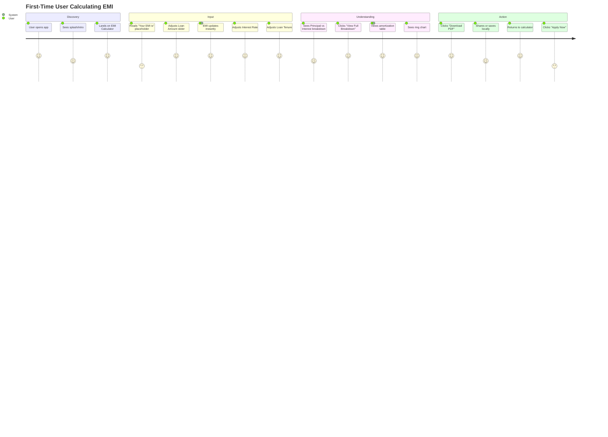

---

## User Journey 2: Exploring TVM Calculators

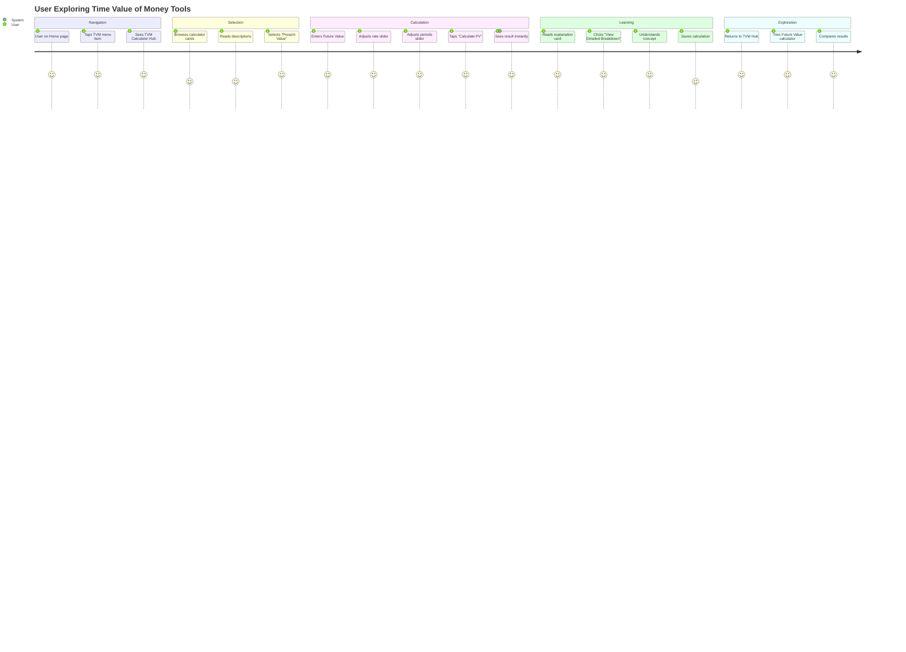

---

## User Journey 3: Learning Financial Concepts

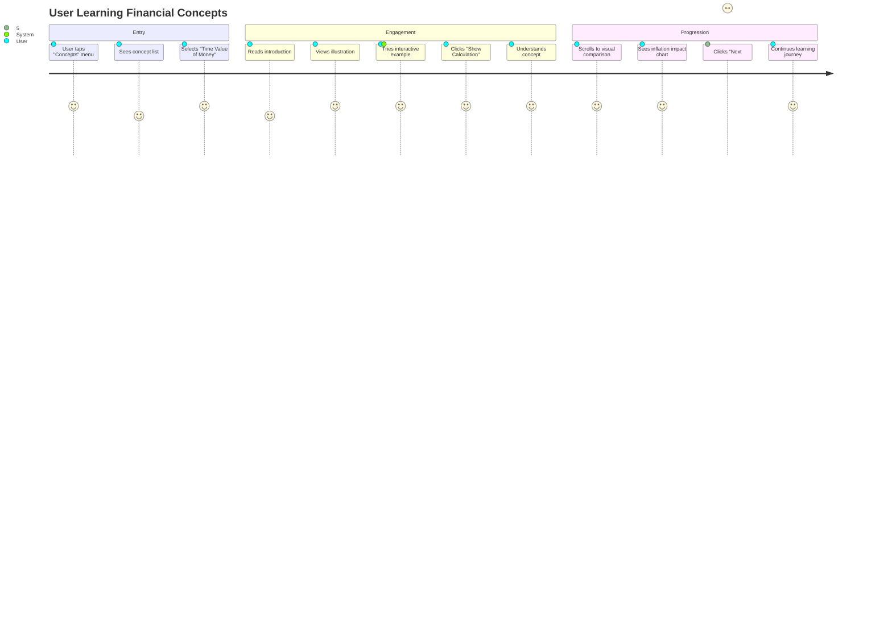

---

## Detailed Flow: EMI Calculation Process

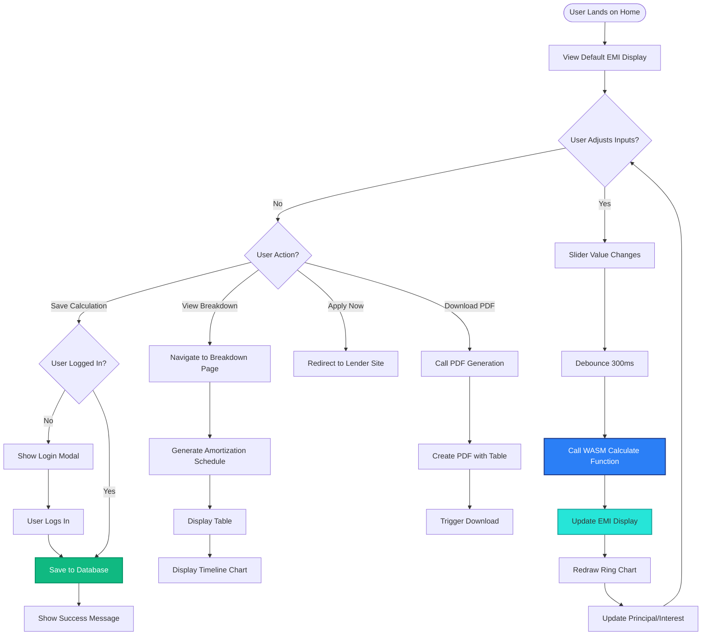

---

## Detailed Flow: TVM Calculator Process

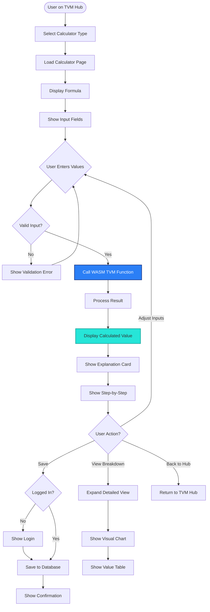

---

## Detailed Flow: Authentication & User Management

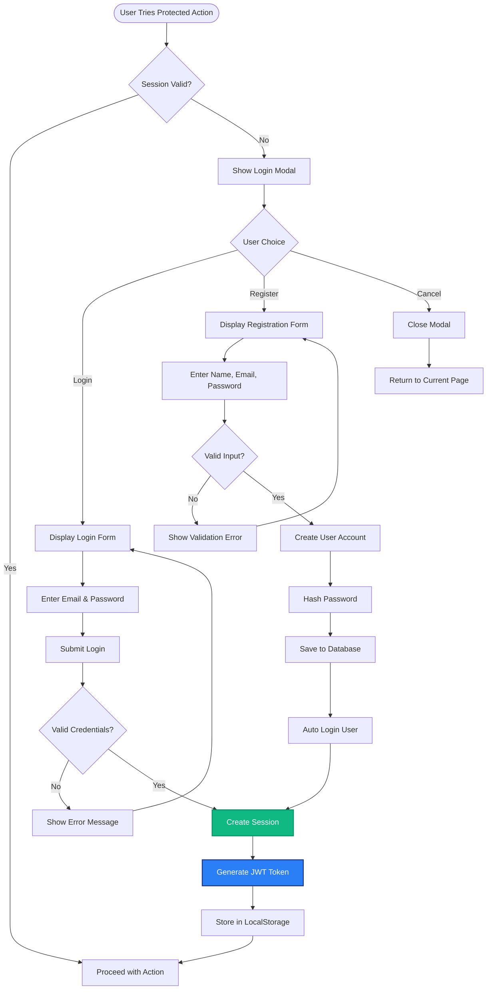

---

## Detailed Flow: Admin Content Management

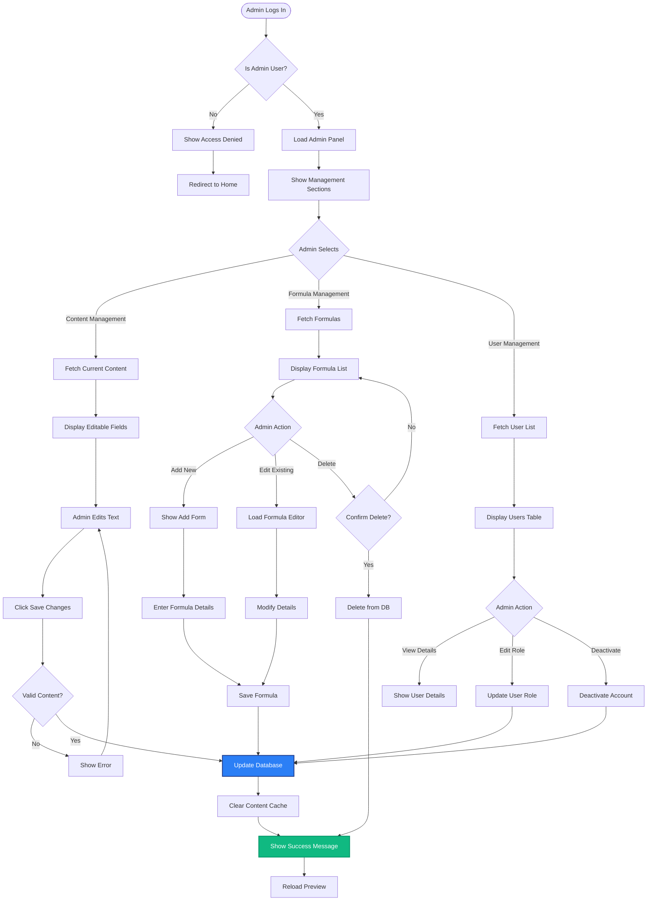

---

## Detailed Flow: PDF Export Process

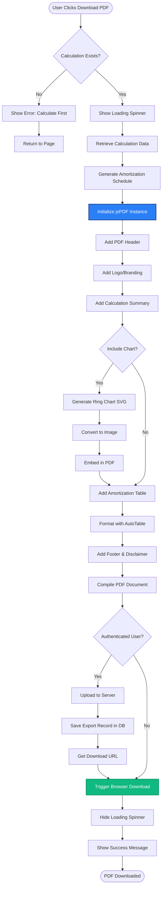

---

## Interaction Patterns

### Pattern 1: Real-Time Calculation

```
User Action          System Response          Timing
───────────────────────────────────────────────────────
Drag slider       →  Update value display     0ms
                  →  Debounce starts          0ms
                     (Wait 300ms)
                  →  Call WASM calculator     300ms
                  →  Receive result           302ms
                  →  Animate number change    302-502ms
                  →  Redraw chart             302-1102ms
                  →  Update breakdown text    302ms
```

### Pattern 2: Navigation Flow

```
User Interaction        State Change           UI Update
───────────────────────────────────────────────────────────
Tap menu item        →  Set active route    →  Highlight menu
                     →  Fetch page data     →  Show loading
                     →  Update content      →  Fade in page
                     →  Scroll to top       →  Smooth scroll
```

### Pattern 3: Form Validation

```
User Input            Validation              Feedback
───────────────────────────────────────────────────────
Enter text         →  Check on blur        →  Show inline error
                   →  Real-time check      →  Update error message
Fix error          →  Revalidate           →  Remove error
                   →  Enable submit        →  Highlight button
```

### Pattern 4: Data Persistence

```
User Action           Backend Process         User Feedback
────────────────────────────────────────────────────────────
Click "Save"       →  Validate session     →  Show loading
                   →  Prepare payload      →  Disable button
                   →  POST to API          →  Loading spinner
                   →  Receive response     →  Hide loading
                   →  Update local state   →  Show success toast
                   →  Update UI            →  Enable button
```

---

## State Management Flow

### Global State (Zustand)

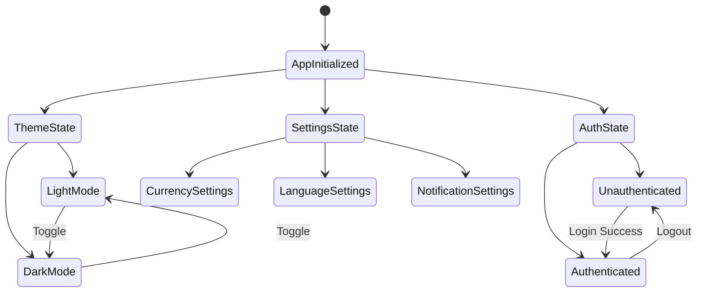

### Local Component State

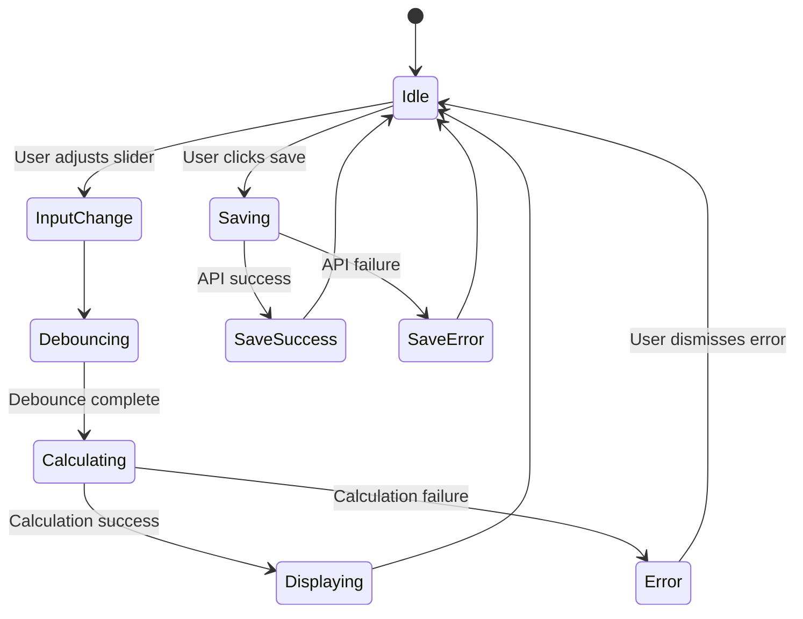

---

## Error Handling Flows

### Flow 1: Calculation Error

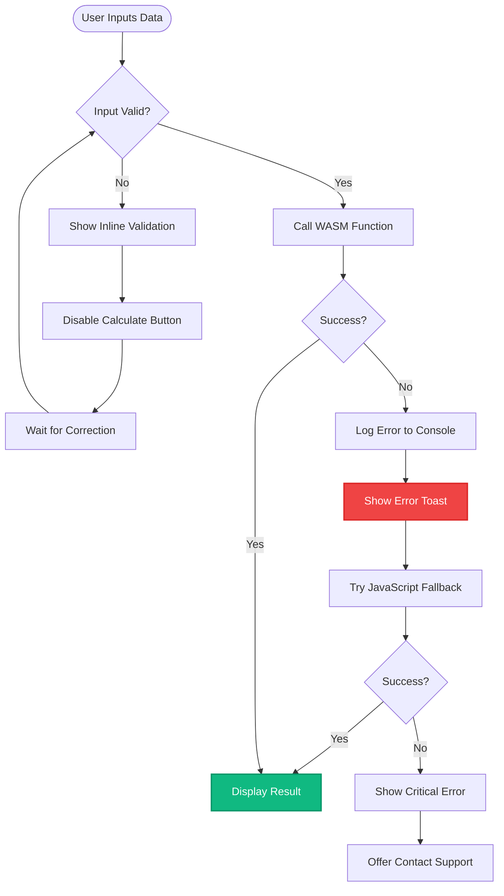

### Flow 2: API Error

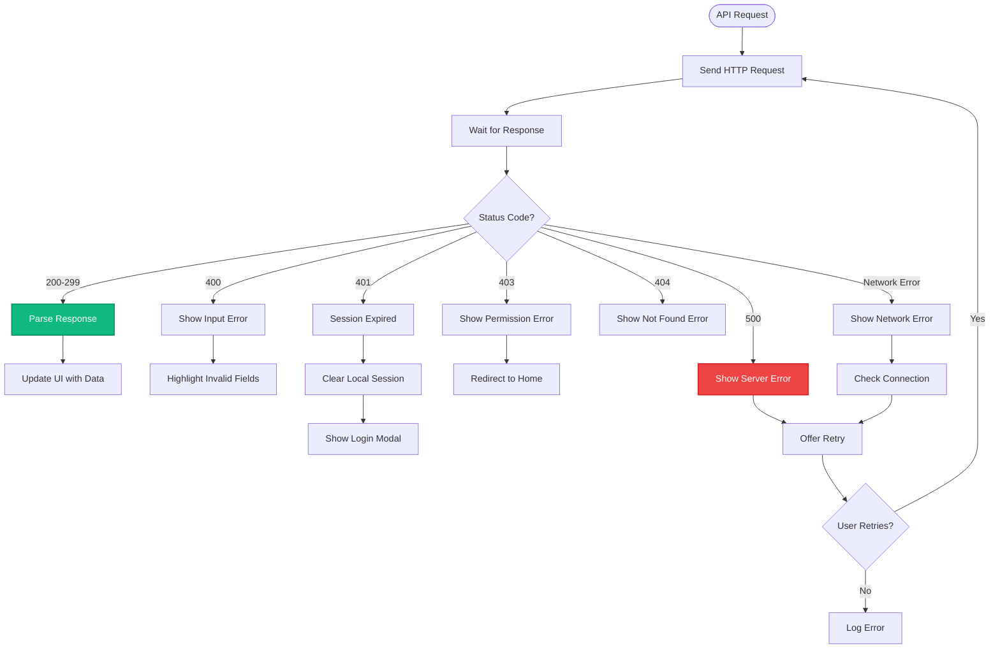

---

## Loading & Performance Optimization

### Progressive Loading Strategy

```
Page Load Sequence:
──────────────────────────────────────────────────────
0ms     → Load HTML skeleton
50ms    → Load critical CSS
100ms   → Initialize theme
150ms   → Render header & navigation
200ms   → Load WASM module (async)
250ms   → Render main content
300ms   → Load Web Fonts (swap)
350ms   → Initialize charts
400ms   → Load non-critical assets
500ms   → Page fully interactive
```

### Code Splitting Strategy

```
Bundle Distribution:
──────────────────────────────────────────────────────
main.js (40KB)      → Core app + EMI calculator
tvm.js (25KB)       → TVM calculators (lazy load)
charts.js (30KB)    → Chart components (lazy load)
admin.js (20KB)     → Admin panel (lazy load)
vendor.js (80KB)    → React + dependencies
wasm.wasm (15KB)    → C/C++ calculations
```

---

## Offline Support Flow

```mermaid
flowchart TD
    Start([User Opens App]) --> CheckOnline{Online?}
    
    CheckOnline -->|Yes| LoadFresh[Load Fresh Data]
    LoadFresh --> UpdateCache[Update Service Worker Cache]
    UpdateCache --> RenderApp[Render App]
    
    CheckOnline -->|No| LoadCache[Load from Cache]
    LoadCache --> ShowOfflineBanner[Show Offline Banner]
    ShowOfflineBanner --> RenderApp
    
    RenderApp --> UserCalculates[User Calculates EMI]
    UserCalculates --> LocalCalc[Calculate Locally with WASM]
    LocalCalc --> Display[Display Result]
    
    Display --> UserSaves[User Tries to Save]
    UserSaves --> CheckOnline2{Online?}
    
    CheckOnline2 -->|Yes| SaveToServer[Save to Server]
    SaveToServer --> Confirmation[Show Confirmation]
    
    CheckOnline2 -->|No| QueueAction[Queue Action]
    QueueAction --> SaveLocal[Save to IndexedDB]
    SaveLocal --> ShowQueued[Show "Will Sync Later"]
    
    ShowQueued --> WaitOnline[Wait for Connection]
    WaitOnline --> BackOnline{Back Online?}
    
    BackOnline -->|Yes| SyncQueued[Sync Queued Actions]
    SyncQueued --> SaveToServer
    
    style LocalCalc fill:#2B7FF6,stroke:#1E3A8A,stroke-width:2px,color:#fff
    style ShowOfflineBanner fill:#F59E0B,stroke:#D97706,stroke-width:2px
```

---

## Accessibility Navigation Flow

### Keyboard Navigation

```
Tab Order:
────────────────────────────────────────────
1. Theme Toggle (Header)
2. Navigation Menu
3. Loan Amount Slider
4. Loan Amount Input (alternative)
5. Interest Rate Slider
6. Interest Rate Input (alternative)
7. Loan Tenure Slider
8. Loan Tenure Input (alternative)
9. Apply Now Button
10. Save Calculation Link
11. View Breakdown Link
12. Footer Links

Keyboard Shortcuts:
────────────────────────────────────────────
Space/Enter  → Activate focused element
Arrow Keys   → Adjust slider values (±1)
Shift+Arrow  → Adjust slider values (±10)
Tab          → Next focusable element
Shift+Tab    → Previous focusable element
Esc          → Close modal/dropdown
/            → Focus search (on formula page)
```

### Screen Reader Announcements

```
Interaction              Announcement
─────────────────────────────────────────────────────
Slider adjustment     →  "Loan amount: $25,000"
Calculation complete  →  "EMI calculated: $250 per month"
Page navigation       →  "Navigated to Breakdown page"
Error occurs          →  "Error: Please enter valid amount"
Save success          →  "Calculation saved successfully"
```

---

## Mobile Gestures

```
Gesture                Action                  Page
──────────────────────────────────────────────────────
Swipe Left          →  Next TVM Calculator  →  TVM Hub
Swipe Right         →  Previous Calculator  →  TVM Hub
Pull Down           →  Refresh data         →  Any page
Pinch Zoom          →  Zoom chart           →  Breakdown
Long Press          →  Show context menu    →  Saved calcs
Double Tap          →  Quick save           →  Calculator
```

---

## Summary of Key UX Principles

1. **Immediate Feedback**: All interactions provide instant visual feedback
2. **Progressive Disclosure**: Complex features revealed as needed
3. **Error Prevention**: Input validation before calculation
4. **Recovery**: Clear error messages with actionable solutions
5. **Consistency**: Same patterns across all calculators
6. **Efficiency**: Real-time calculations, no submit buttons
7. **Accessibility**: Full keyboard navigation and screen reader support
8. **Offline First**: Core calculations work without internet
9. **Mobile First**: Optimized for touch and small screens
10. **Performance**: Sub-second calculations, smooth 60fps animations

